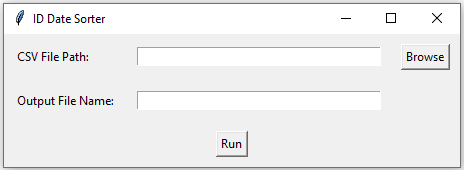
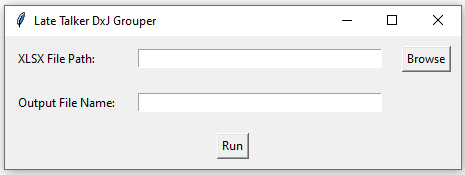
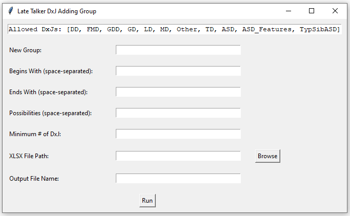
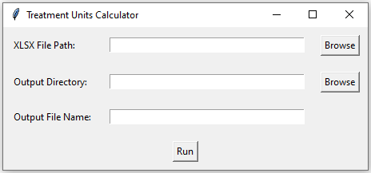

## Scripts for ACE Clinical Data Management

### Requirements

Scripts made using Python 3.10.9

If you wish to use the included notebooks, jupyter must also be installed. Included is a requirements.txt with all necessary installs.

Run:
```pip install -r requirements.txt```

or if using Conda:
```conda install --file requirements.txt```

### How to Run

1. Open your local terminal
2. ```cd``` into this repository
3. run a chosen script by entering ```python ___.py```

### Flagger



Steps:
1. ```python Flagger.py```
2. Browse for desired exported data file
3. Choose a filename (without extension)
4. ```Run```

### Group



Steps:
1. ```python Group.py```
2. Browse for original late talkers data sheet
3. Choose a filename (without extension)
4. ```Run```

### AddGroup



Steps:
1. ```python AddGroup.py```
2. Enter name of new DxJ group in ```New Group```
3. Enter desired first DxJs in ```Begins With``` or leave blank for all allowed DxJs
4. Enter desired last DxJs in ```Ends With``` or leave blank for all allowed DxJs
5. Enter desired possible DxJs between the first and last dxj in ```Possibilities``` or leave blank for all allowed DxJs
6. Enter minimum number of DxJs for the group in ```Minimum # of DxJ``` (i.e. ASD-LD-ASD requires 3 while ASD-ASD requires 2)
7. Browse for exported sheet resulting from ```Group.py```
8. Choose a filename (without extension)
9. ```Run```

### Treatment Hours



Steps:
1. ```python TreatmentHoursConsolidated.py``` or ```python TreatmentHoursFull.py```
2. Browse for desired tx hours data sheet
3. Choose a filename (without extension)
4. ```Run```
