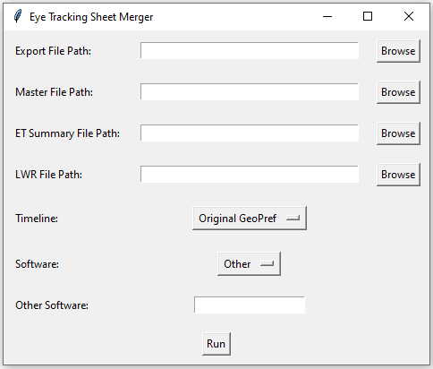
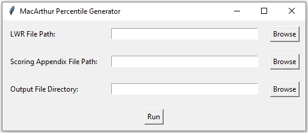

## Scripts for ACE Clinical Data Management

### Requirements

Scripts made using Python 3.12

Included is a requirements.txt with all necessary installs.

After cloning this repository, ```cd``` in and run:
```pip install -r requirements.txt```

or if using Conda:
```conda install --file requirements.txt```

### How to Run

1. Open your local terminal
2. ```cd``` into this repository
3. run a chosen script by entering ```python ___.py```

### Eye Tracking Sheet Merger



Takes 4 files and aggregates the data according to what timeline is used, appending the result to the running master data sheet for the given test

Steps:
1. ```python UpdateEyeTracking.py```
2. Browse for desired exported data file
3. Browse for corresponding Master sheet
4. Browse for most recent ET Summary sheet
5. Browse for most recent LWR sheet
6. Select the timeline of the data based on the selected exported/master data
7. Select the 'software' used for the exported data
8. ```Run```

### Flagger


Sorts output form data by Subject ID and Visit Date, flagging each visit with the visit number

Steps:
1. ```python Flagger.py```
2. Browse for desired exported data file
3. Choose a filename (without extension)
4. ```Run```

### Group


Groups the late talkers data into categorized diagnostic groups (Always Typical, Transient Language Delay, Persistent Language Delay, Persistent Global Delay, LD to ASD, Persistent ASD)

1. ```python Group.py```
2. Browse for original late talkers data sheet
3. Choose a filename (without extension)
4. ```Run```

### AddGroup


Allows user to create a new diagnostic group to the grouped late talkers data

Steps:
1. ```python AddGroup.py```
2. Enter name of new DxJ group in ```New Group```
3. Enter desired first DxJs in ```Begins With``` or leave blank for all allowed DxJs
4. Enter desired last DxJs in ```Ends With``` or leave blank for all allowed DxJs
5. Enter desired possible DxJs between the first and last dxj in ```Possibilities``` or leave blank for all allowed DxJs
6. Enter minimum number of DxJs for the group in ```Minimum # of DxJ``` (i.e. ASD-LD-ASD requires 3 while ASD-ASD requires 2)
7. Browse for exported sheet resulting from ```Group.py```
8. Choose a filename (without extension)
9. ```Run```

Example: ASD Transition contains no TD, ASD Features, DD or GDD and must not begin with ASD
- Entries: ASD Transition; FMD GD LD MD Other TypSibASD; ASD; FMD GD LD MD Other ASD TypSibASD; 2; 'filepath'; 'output name';

### Treatment Hours


Calculates the total/average number of units a subject has in a given treatment

Steps:
1. ```python TreatmentHoursConsolidated.py``` or ```python TreatmentHoursFull.py```
2. Browse for desired tx hours data sheet
3. Choose a filename (without extension)
4. ```Run```

### MacArthur Percentile Calculator



Populates the LWR with the most appropriate percentile by visit/section based on the MacArthur Bates ranking charts

Steps:
1. ```python MacArthurPercentiles.py```
2. Browse for most recent LWR
3. Browse for the scoring appendix sheet
4. Browse for desired output directory (will output file as 'macarthur_percentiles.xlsx' here)
4. ```Run```
